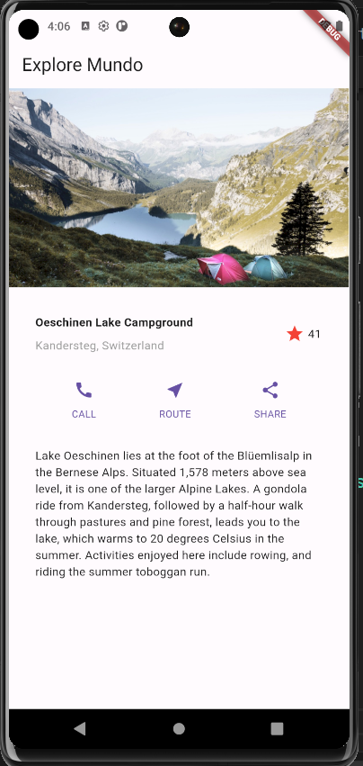
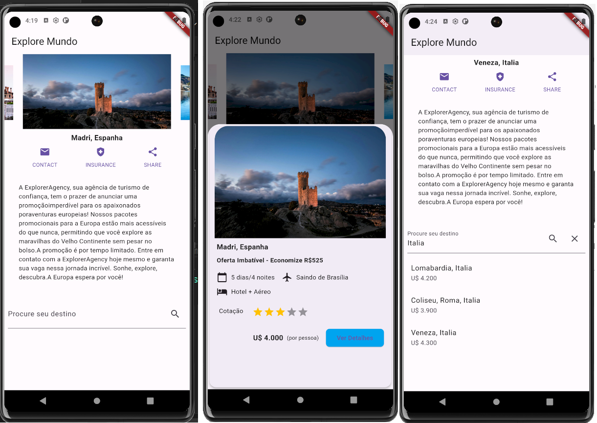
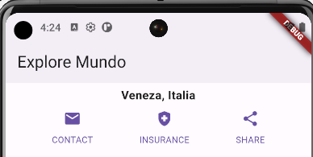
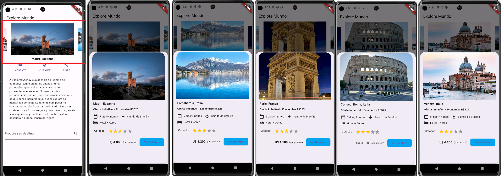
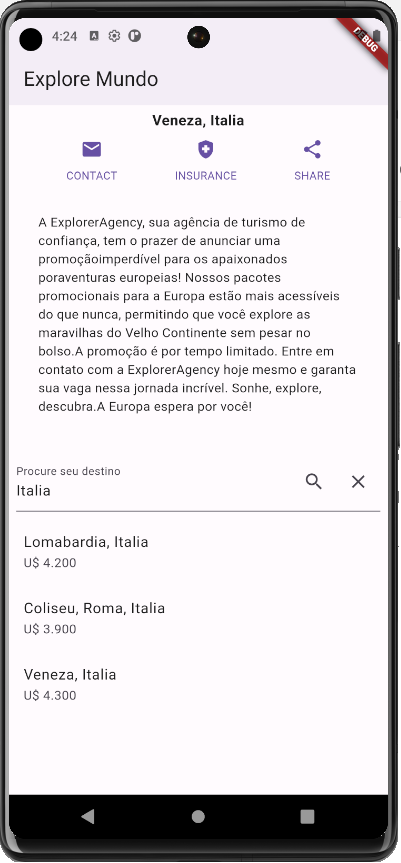

# Missão Prática | Nível 2 | Mundo 4


- Introdução

```
Esta atividade esta dividida em duas partes sendo a primeira a 
de Microatividades (Parte 1) e a segunda, desenvolvimento de um App (Parte 2)
```


- Objetivos da prática
```
   - Configurar o ambiente de desenvolvimento Flutter;
   - Utilização de widgets Básicos; 
   - Criação de layouts básicos;
   - Utilização do Widget ListView em Flutter.
   - Desenvolvimento de Outra Funcionalidade para o Widget em Flutter.
``` 

 - Especificação

https://sway.cloud.microsoft/s/MaC4thQaZwjelq5H/embed


- obs: cada microatividade esta sendo representada como um widget

# Microatividades (Parte 1)


## 1 - Preparação do ambiente

- Material necessário para a prática

Flutter SDK (Pode ser baixado no site oficial do Flutter);
Android Studio e/ou um editor de texto (Intellij idea community);
Git para controle de versionamento;
Emulador Android ou iOS para testar o aplicativo

- Descrição
``` 
Esta atividade tem como objetivo preparar a configuração do ambiente de
desenvolvimento Flutter para a plataforma Windows, MacOS e Linux,
fornecendo-lhes as ferramentas essenciais e orientações para começar a criar
aplicativos móveis com esta tecnologia.  

No meu caso foi feito para ambiente Windows
``` 
Instalando o VSCODE : https://code.visualstudio.com/

Instalando o flutter no Windows : https://docs.flutter.dev/get-started/install/windows

Instalando o Node :  https://nodejs.org/en
 
Instalando o android studio : https://bit.ly/492ToHS

2. Após a conclusão das instalações, você pode verificar se o Node.js e o npm estão
instalados abrindo um prompt de comando e executando os seguintes comandos:

> node --version 
> npm  --version


 
 - verificação do flutter doctor

 > flutter doctor


 
obs: optei pelo yarn ao invés do npm que tem foco na velocidade, segurança e confiabilidade.

>npm install --global yarn


 ### Configurações adicionais

 - Instalação do Android Studio  

  Vá para https://developer.android.com/?hl=pt-br 
  
  procure logo abaixo por "Fazer download do android studio"

 

<BR>

- No meu caso minha instalação ficou assim :

``` 
Android Studio Giraffe | 2022.3.1 Patch 3
Build #AI-223.8836.35.2231.11005911, built on October 25, 2023
Runtime version: 17.0.6+0-b2043.56-10027231 amd64
VM: OpenJDK 64-Bit Server VM by JetBrains s.r.o.
Windows 11 10.0
GC: G1 Young Generation, G1 Old Generation
Memory: 1280M
Cores: 8
Registry:
    external.system.auto.import.disabled=true
    ide.text.editor.with.preview.show.floating.toolbar=false

Non-Bundled Plugins:
    Dart (223.8977)
    io.flutter (76.3.2) 

``` 
- Android Studio instalado

 

 <BR>
- Android SDK 

 <BR>
 

  <BR>
 - Emulator : No meu caso, optei por executar o emulador via arquivo bat
  
 <BR>


  <BR>

## Criando o app de microatividades

 -  Agora abra um prompt e vá para o diretório onde você deseja que o projeto fique e execute o seguinte comando:

> flutter create microatividades

    
 -  Depois que o projeto for criado, vá para o diretório do projeto executando o seguinte
comando no prompt de comando:

> cd microatividades

> code .


Resultados esperados
```
Ao concluir esta microatividade, você estará habilitado a desenvolver
aplicações de maneira ágil, segura e flexível. Iniciando com a
configuração e instalação do Flutter em sua máquina, você terá os
fundamentos necessários para criar aplicativos incríveis.

```
 <BR> 
 
 
<br>

# Microatividades (Compomentes)

```
 Foi adaptado um menu drawer para o acesso as atividades, a numerção das atividades, 
 será mantida como forma de referência a especificação original.  

``` 
<BR> 
 
 
<br>

 - Inicialização do App

<BR> 
 
 
<br>

## 2 - Utilização de Widgets Flutter Básicos - MaterialApp, Scaffold e AppBar

- Descrição:
```
Nesta atividade, foi a de implementar um app simples utilizando widgets básicos MaterialApp,
Scaffold e AppBar que juntos criam a estrutura básica de uma aplicação Flutter, facilitando 
a implementação de uma interface de usuário coesa e funcional que segue os princípios do 
design Material.
 
```
 

 <BR> 
 

 <BR>

  - Resultados esperados
```
Os resultados aguardados para esta microatividade incluem a visualização, no
simulador Android ou iOS, do texto inserido pelo aluno durante a etapa 3 do roteiro.
Além disso, de maneira subjetiva, espera-se que o aluno adquira uma compreensão
da estrutura de Widgets básicos em um aplicativo Flutter. Essa compreensão deve
abranger conceitos essenciais, como MaterialApp, Scaffold, AppBar, e outros
elementos fundamentais para o desenvolvimento em Flutter..
```


## 3 -  Criação de layouts básicos com os Widgets

- Descrição
```
Nesta atividade, foi a de criar uma Crie um layout utilizando a composição de Widgets.Nesta 
tela foram utilizados os widgets,Icon,Text,Column,Row,Padding,Conteiner entre outros.

```

<BR>


<BR>

 Resultados esperados

 ``` 
Espera-se que, com esta atividade, o participante identifique alguns tipos de layouts
disponíveis para a criação de aplicativos Flutter. Esses layouts ajudam a organizar os
elementos na tela, utilizando Widgets como Column, Row, Text e Icon. A figura abaixo
ilustra o resultado desejado, permitindo a escolha do widget de layout mais adequado
com base nas necessidades do design.
```  

## 4 - Utilização do Widget ListView em Flutter

- Descrição
``` 
Nesta atividade foi a de criar tela compostas por listas, e para isso, foi utilizado o widget ListView.

``` 

<BR>


<BR>

 Resultados esperados

 ``` 
Esta microatividade possibilita a criação da interface do usuário (UI) por meio de
widgets, descrevendo a aparência da visualização de acordo com sua configuração e
estado atual. Ao adicionar interatividade ao seu aplicativo Flutter, você terá como
resultado uma lista visualmente organizada e funcional, utilizando o widget ListView.

A imagem a seguir ilustra os dois procedimentos acima, mostrando a estrutura visual
resultante da utilização do widget ListView.

```  

## 5 - Desenvolvimento de Outra Funcionalidade para o Widget em Flutter, widget Stack

- Descrição
``` 
Em determinadas situações, é necessário empilhar um Widget sobre o outro.
Observe que o texto está posicionado "acima" da imagem. O widget utilizado para
criar essa pilha de widgets é o Stack

``` 
 
<BR>


<BR>

Resultados esperados

 ``` 
Visualize algumas definições básicas que devem ser feitas antes da customização.
Utilizando o mecanismo de layout do Flutter, os Widgets, aprenderá a usá-los para
construir layouts, definir itens na vertical e horizontal, listas, fotos fixas, entre outros.
Este procedimento proporcionará uma compreensão prática da funcionalidade do
widget Stack, permitindo a criação de sobreposições de widgets em seu aplicativo
Flutter, como exemplificado nas imagens a seguir. A imagem da direita apresenta o
resultado do código apresentado acima.

```  
  
 ## Missão Prática | Posso criar um App de outra forma!

 ```
    Nessa atividade recebemos a missão de realizar melhorias em um app pronto tendo que incluir novas 
   funcionalidades com o objetivo de proporcionar uma experiência dos usuários mas cuidando em 
   manter funcionalidades basicas existentes.
 ```
   - Obviamente serão apenas indicações de possiveis soluções a serem desenvolvidas como consultar pacotes de viagens, 
   efetuar reservas, entrar em contato com a equipe e obter informações detalhadas sobre a localização e as avaliações 
   de estrelas para cada destino etc, etc...


    - Solução original

<BR>


<BR>    

    - Solução proposta

<BR>


<BR>      

1 - modificação dos icones 

 - Essa modificação tem como intuito promover ao usuário
acesso rapido a : 

   - contato e-mail
   - central de seguro viagem
   - compartilhamento

<BR>


<BR>    

2 - Carrossel de imagens

- Apresentação de um carrossel de imagems que ao se clicar sob a imagem sera 
aberto um form modal contendo  detalhe, informações etc..


<BR>


<BR> 

3 - Pesquisa de destinos

  Fornece a lista de destinos em função do resultado de pesquisa qua ao se 
clicar sob o item, será aberta o form modal contendo detalhes 

obs: para fins de apresentação, foi usado um array 'mock'.


<BR>


<BR>

Organização do código

Estruturalmente o código esta dividido em :

1. **MyApp e Home Widget**:
   - O ponto de entrada do aplicativo (`MyApp`) configura o tema e a tela inicial (`Home`). A tela inicial parece servir como um hub para as diversas funcionalidades do aplicativo, incluindo a visualização de destinos em destaque e a busca por destinos específicos.

2. **DestinationsCarousel**:
   - Um widget que exibe um carrossel de imagens dos destinos turísticos. Cada imagem no carrossel é interativa, permitindo aos usuários tocar para obter mais informações sobre o destino. Isso sugere um foco visual forte no aplicativo, destacando destinos atraentes para os usuários.

3. **DestinationSearchWidget**:
   - Permite aos usuários pesquisar destinos turísticos por nome. A pesquisa atualiza dinamicamente os resultados, melhorando a interatividade e a usabilidade do aplicativo ao facilitar a localização de destinos específicos.

4. **ShowModalDestinations**:
   - Um widget que é chamado para mostrar detalhes de um destino turístico em uma modal. Isso inclui a imagem do destino, descrição, preço e outras informações relevantes, como avaliações. A presença de um botão "Ver Detalhes" sugere que mais informações ou ações podem ser disponibilizadas, como reservar o pacote turístico.

5. **Dados dos Destinos (imgDestinations)**:
   - Uma lista de mapas que contém informações sobre os destinos turísticos, incluindo URLs de imagens, descrições textuais e preços. Esta lista serve como uma base de dados dentro do aplicativo, permitindo a alimentação dos widgets com informações relevantes.

### Objetivos do Projeto

Com base nos componentes identificados, os objetivos principais do projeto parecem ser:

- **Promover Destinos Turísticos**: Apresentar aos usuários uma seleção atraente de destinos turísticos, incentivando o interesse e a exploração de novos lugares.
- **Facilitar a Descoberta**: Permitir que os usuários descubram facilmente informações sobre destinos turísticos, incluindo imagens, preços e descrições.
- **Interatividade e Usabilidade**: Oferecer uma interface interativa e fácil de usar, onde os usuários podem pesquisar destinos, avaliar opções e obter detalhes completos sobre pacotes turísticos.
- **Promoção de Pacotes Turísticos**: Além de fornecer informações, o aplicativo provavelmente visa facilitar a reserva ou a compra de pacotes turísticos, embora os detalhes específicos da implementação dessa funcionalidade não tenham sido fornecidos nos códigos.

### Conclusão

O projeto é um aplicativo Flutter para uma agência de turismo, projetado para ser visualmente atraente, informativo e fácil de navegar. Ele combina elementos visuais, como um carrossel de imagens, com funcionalidades interativas, como pesquisa e avaliação de destinos, para criar uma experiência de usuário rica e engajadora voltada para a exploração e reserva de viagens turísticas.


 